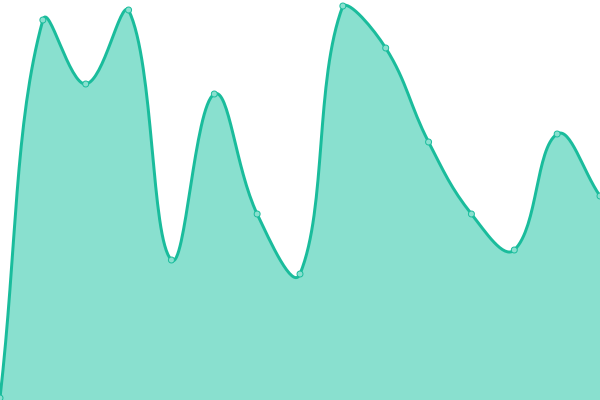
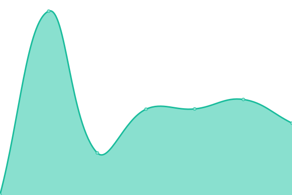
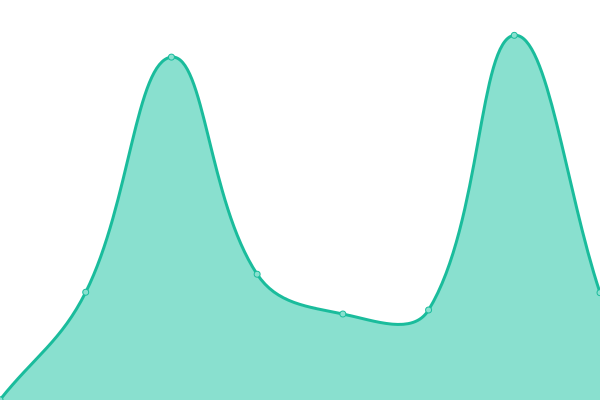

# [📈 Live Status](https://uptime.damoun.cloud): <!--live status--> **🟧 Partial outage**

This repository contains the open-source uptime monitor and status page for [Damien Plénard](damien.plenard.me), powered by [Upptime](https://github.com/upptime/upptime).

With [Upptime](https://upptime.js.org), you can get your own unlimited and free uptime monitor and status page, powered entirely by a GitHub repository. We use [Issues](https://github.com/damoun/uptime/issues) as incident reports, [Actions](https://github.com/damoun/uptime/actions) as uptime monitors, and [Pages](https://uptime.damoun.cloud) for the status page.

<!--start: status pages-->
<!-- This summary is generated by Upptime (https://github.com/upptime/upptime) -->
<!-- Do not edit this manually, your changes will be overwritten -->
<!-- prettier-ignore -->
| URL | Status | History | Response Time | Uptime |
| --- | ------ | ------- | ------------- | ------ |
|  [twitch.tv/dam0un](https://www.twitch.tv/dam0un) | 🟩 Up | [twitch-tv-dam0un.yml](https://github.com/damoun/uptime/commits/HEAD/history/twitch-tv-dam0un.yml) | 

 200ms
     
 | 

<a href="https://status.damoun.cloud/history/twitch-tv-dam0un">100.00%</a>
    

|  [dam0un.live](https://dam0un.live) | 🟥 Down | [dam0un-live.yml](https://github.com/damoun/uptime/commits/HEAD/history/dam0un-live.yml) | 

 133ms
     
 | 

<a href="https://status.damoun.cloud/history/dam0un-live">99.38%</a>
    

|  [damien.plenard.me](https://damien.plenard.me) | 🟩 Up | [damien-plenard-me.yml](https://github.com/damoun/uptime/commits/HEAD/history/damien-plenard-me.yml) | 

 193ms
     
 | 

<a href="https://status.damoun.cloud/history/damien-plenard-me">100.00%</a>
    

|  [damoun.link](https://damoun.link) | 🟩 Up | [damoun-link.yml](https://github.com/damoun/uptime/commits/HEAD/history/damoun-link.yml) | 

 144ms
     
 | 

<a href="https://status.damoun.cloud/history/damoun-link">100.00%</a>
    

|  [damoun.club](https://damoun.club) | 🟥 Down | [damoun-club.yml](https://github.com/damoun/uptime/commits/HEAD/history/damoun-club.yml) | 

 471ms
     
 | 

<a href="https://status.damoun.cloud/history/damoun-club">36.52%</a>
    

|  [status.damoun.cloud](https://status.damoun.cloud) | 🟩 Up | [status-damoun-cloud.yml](https://github.com/damoun/uptime/commits/HEAD/history/status-damoun-cloud.yml) | 

 163ms
     
 | 

<a href="https://status.damoun.cloud/history/status-damoun-cloud">99.36%</a>
    

<!--end: status pages-->

[**Visit our status website →**](https://uptime.damoun.cloud)

## 📄 License

- Powered by: [Upptime](https://github.com/upptime/upptime)
- Code: [MIT](./LICENSE) © [Damien Plénard](damien.plenard.me)
- Data in the `./history` directory: [Open Database License](https://opendatacommons.org/licenses/odbl/1-0/)
